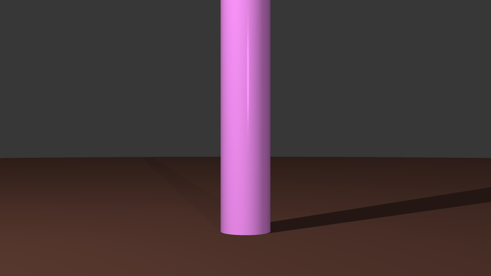
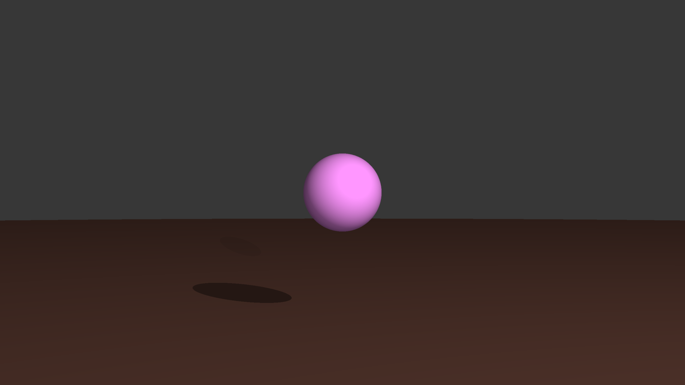
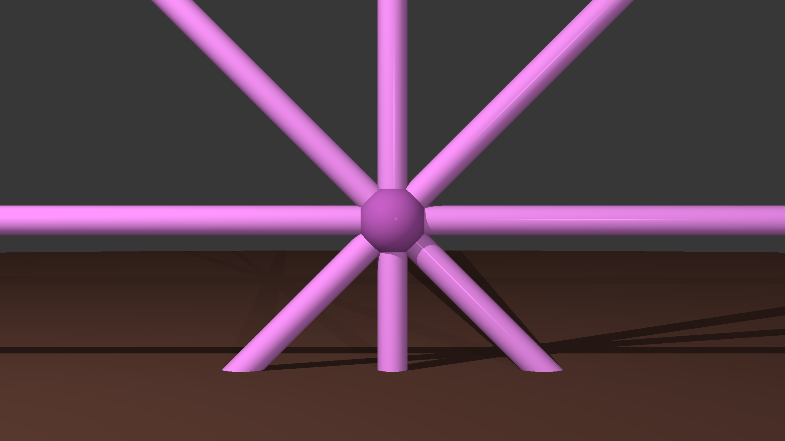
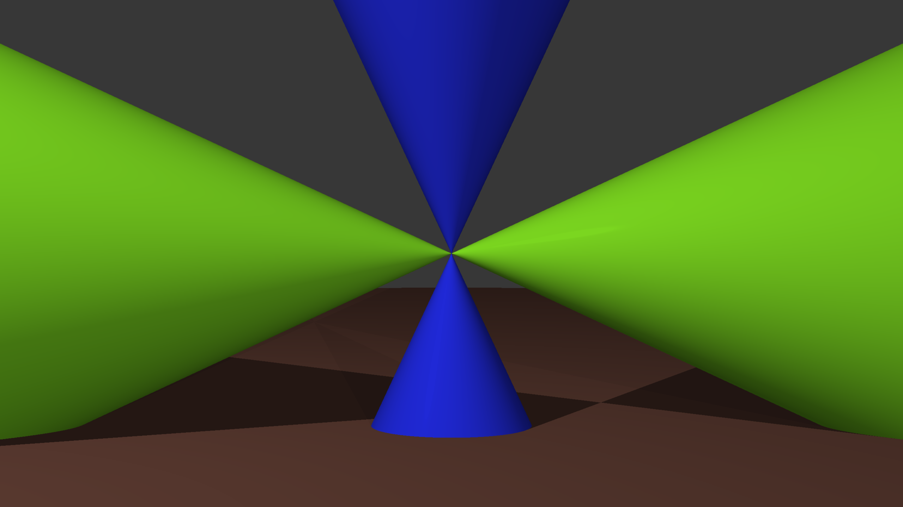
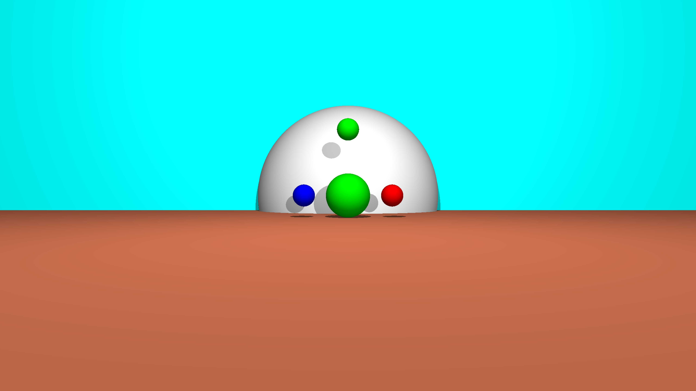
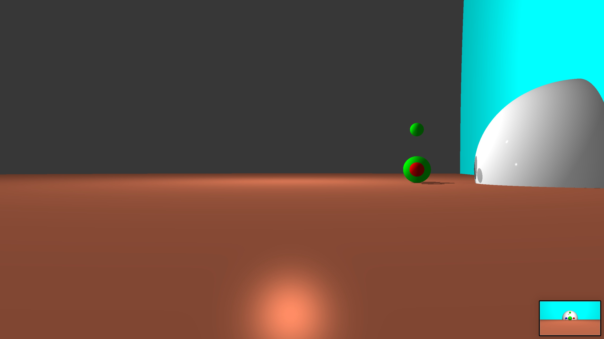
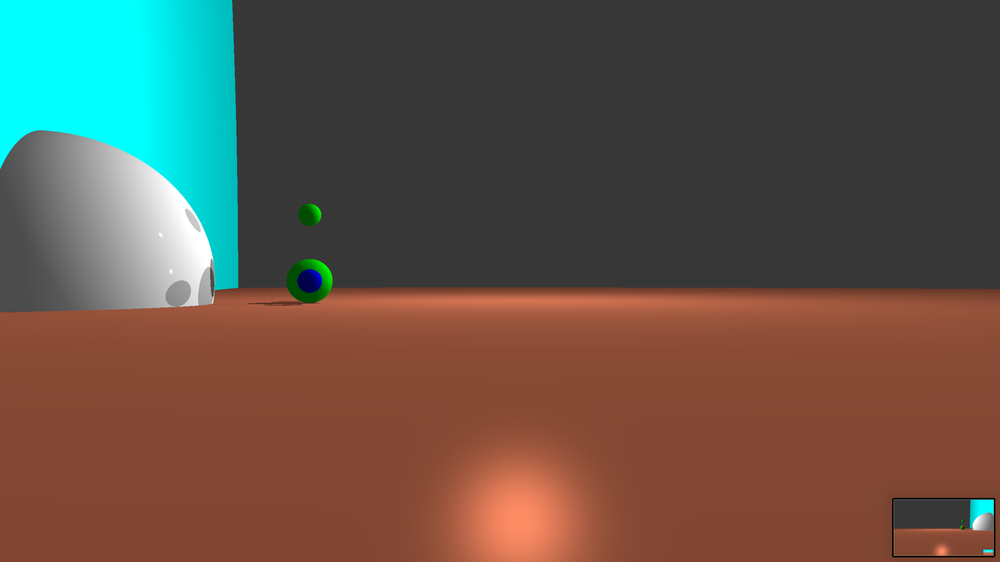

# RTv1
Visualization program using the ray tracing method.


# Install (only for macOS)
Run:
```
git clone --recursive https://github.com/Dovran-Annakuliev/RTv1.git && cd RTv1 && make -s && make clean -s
```


# Start
* Run ```./RTv1 scenes/5_spheres_2_planes_3_spots.txt```.
Examples of scenes can be found in the "scenes" folder.


# Examples
​
​
​
​
​
​
​
